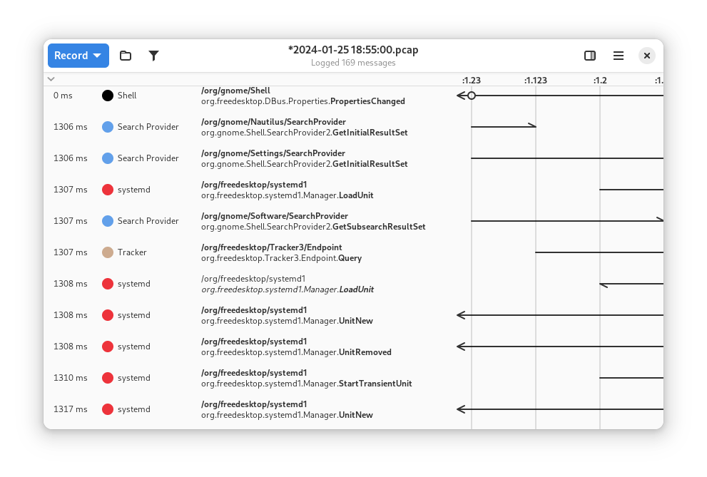

# Bustle

Visualize D-Bus activity

Bustle draws sequence diagrams of D-Bus activity, showing signal
emissions, method calls and their corresponding returns, with timestamps
for each individual event and the duration of each method call. This can
help you check for unwanted D-Bus traffic, and pinpoint why your
D-Bus-based application isn't performing as well as you like. It also
provides statistics like signal frequencies and average method call
times.

## Screenshots

## Hack on Bustle

To build the development version of Bustle and hack on the code
see the [general guide](https://wiki.gnome.org/Newcomers/BuildProject)
for building GNOME apps with Flatpak and GNOME Builder.

## Translations

Helping to translate Bustle or add support to a new language is very welcome.
You can find everything you need at: [l10n.gnome.org/module/bustle/](https://l10n.gnome.org/module/bustle/)

## Code Of Conduct

This project follows the [GNOME Code of Conduct](https://wiki.gnome.org/Foundation/CodeOfConduct).
